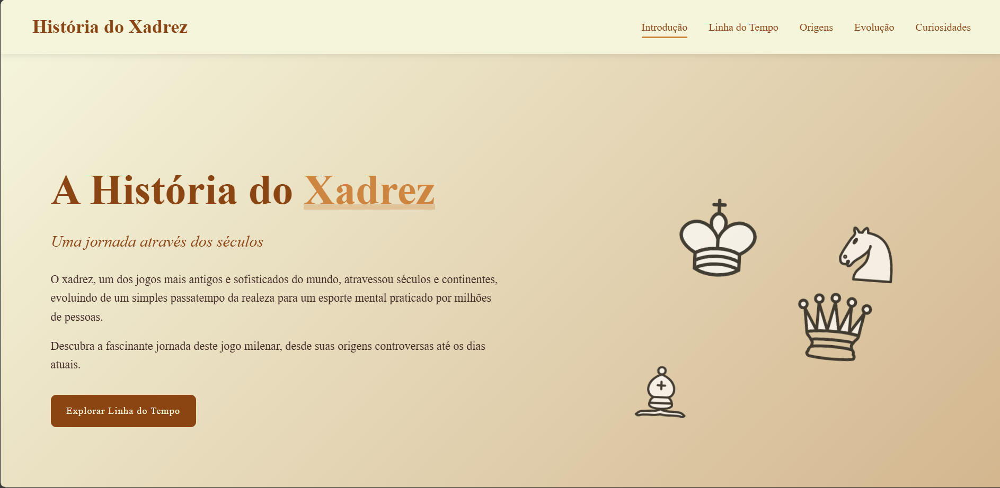

# ♟️ História do Xadrez

Uma jornada interativa pela rica história do xadrez, combinando design cuidadoso com desenvolvimento web moderno.

## ✨ Demonstração

## 🎯 Objetivo

- Aprofundar meu conhecimento sobre a história do xadrez
- Praticar habilidades em HTML, CSS e JavaScript
- Desenvolver um projeto completo desde o protótipo no Figma até a implementação

## 🛠 Tecnologias Utilizadas

| Área       | Tecnologias |
|------------|-------------|
| **Frontend** | HTML5, CSS3, JavaScript |
| **Design**   | Figma (prototipagem) |
| **Extras**   | Animaciones CSS, Responsive Design |

## 📌 Recursos Destacados

- Linha do tempo interativa da evolução do xadrez
- Galeria de peças históricas com zoom
- Seção sobre grandes mestres do xadrez
- Design responsivo para todos os dispositivos
- Efeitos visuais suaves com CSS transitions

## 🎨 Processo de Design

Desenvolvi primeiro um protótipo completo no Figma, considerando:

- Paleta de cores inspirada em tabuleiros antigos
- Tipografia elegante para combinar com o tema histórico
- Wireframes para todas as breakpoints responsivas

 *// Adicione imagem do seu protótipo*

## 🚀 Como Executar Localmente

1. Clone o repositório:
```bash
git clone https://github.com/seu-usuario/chess-history.git
